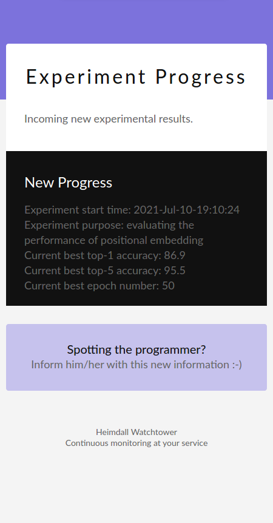
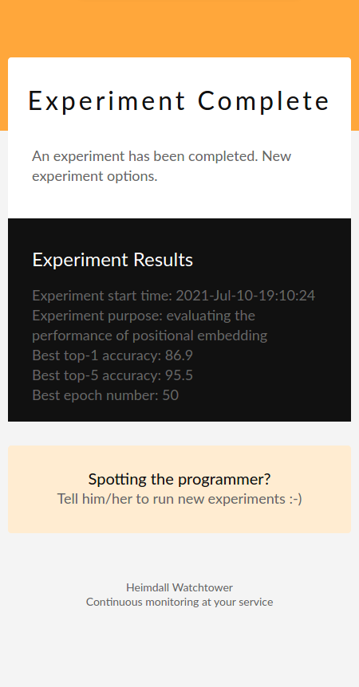
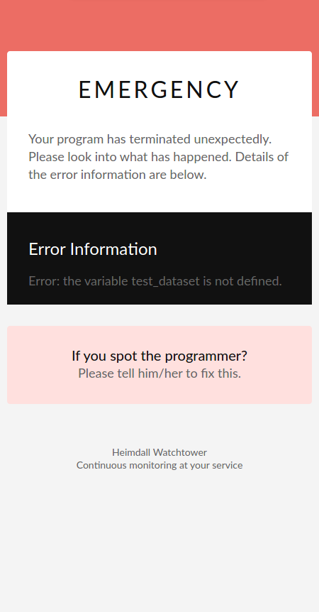
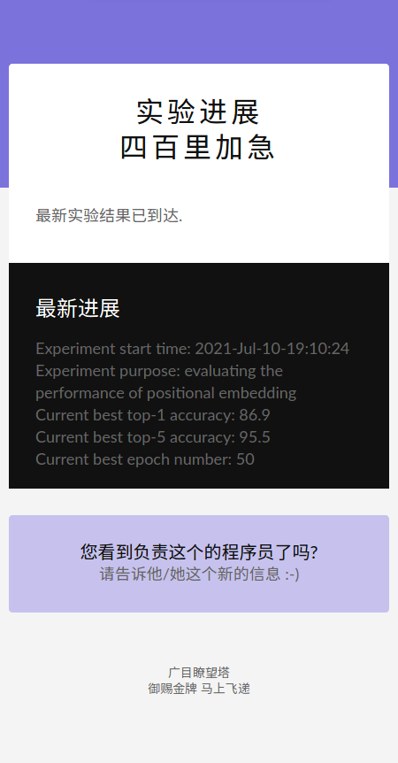
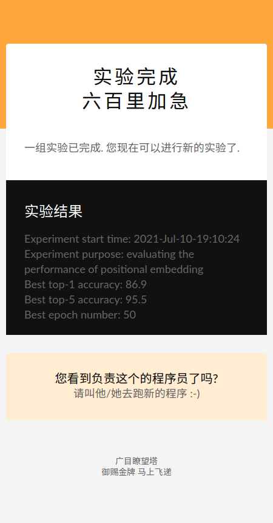
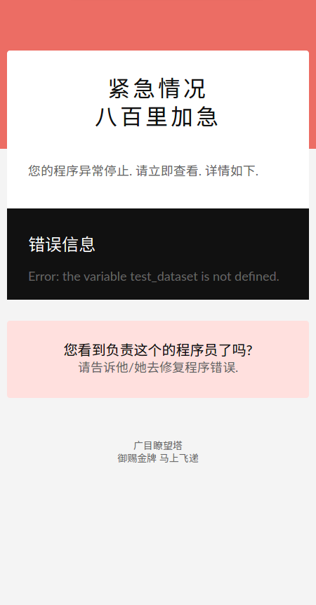

<h1 align="center">
    
    <br>
    Heimdall Watchtower: 
    <br>
    Training Progress Email Notifier
</h1>

<p align="center">
  <a href="#Usage">Usage</a> •
  <a href="#Exhibition">Exhibition</a> •
  <a href="#Citation">Citation</a> •
  <a href="#Credits">Credits</a> •
  <a href="#Licence">Licence</a>
</p>

<h3 align="center">
Overview
</h3>

<p align="center">
<strong align="center">
Heimdall watchtower automatically send you emails to 
notify you of the latest progress of your deep learning 
programs. In this way, you will know how the training goes 
wherever you are. You will also know as soon as your 
program has been terminated by other users :-) 
</strong>
</p>

## Usage
### Quick Start
Simply run 
```bash
python email_test.py
```

**Please note**: The test email is sent through 
a temporal gmail account. It may reach its capacity 
for sending emails through the SMTP server. In this case, 
you will receive no test email. 

### Setup Your Own Email Address
Go to the file `email_config.py` and change the 
email address as well as password there. 
You may need to open the SMTP service from your 
email service provider. 
You may register for a new gmail account. Then, 
open the SMTP service for the new gmail account 
and allow the new account for less-secure app access. 
Instructions: 
- [Open SMTP](https://support.google.com/mail/answer/7126229?hl=en)
- [Allow Less-Secure APP Access](https://support.google.com/accounts/answer/6010255?hl=en)

## Screenshots
<p align="center">
    
    
    
    
    
    
</p>

## Languages 
Currently we support English and Chinese. Development 
of more languages are welcome. 

## Contacts
If you have any questions regarding this implementation. Please lodge Github issues. 
You can also contact Zhenyue Qin (zhenyue.qin@anu.edu.au). 

## Credits
The icon was downloaded from Freeplk: 
- [Freeplk](https://www.flaticon.com/free-icon/message_3062634)

## Licence
[CC-BY-4.0](https://choosealicense.com/licenses/cc-by-4.0/)
